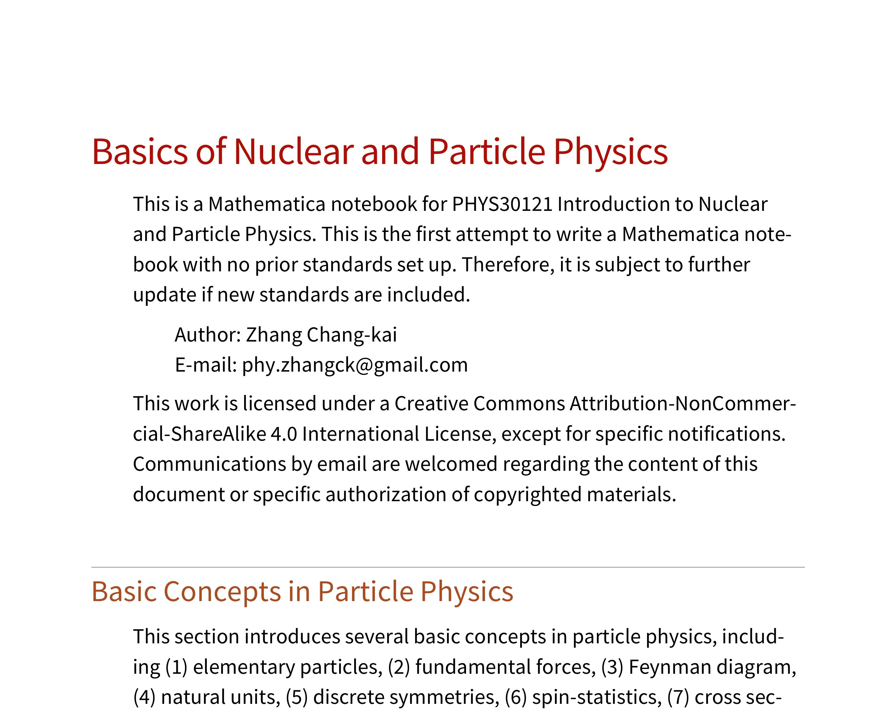

# Exhibition of Works

 This page shows all the works by Zhang Chang-kai, including completed and onging projects and reports. For non-academic news and posts, visit <a href="Blog">News & Posts</a>. Comments are welcomed.

## Featured Works

  <!-- Gauge Gravity Duality -->
  

  <article class="6u 12u$(xsmall) work-item">
    
  </article>
  <article class="6u 12u$(xsmall) illustration" style="/* margin: 13px 0 */">
    
    <a href="Gauge-Gravity-Duality"><h2>Gauge Gravity Duality</h2></a>
    
General review on the Gauge Gravity Duality and its application to holographic entanglement entropy.

    
  </article>
  

  <!-- Constructive Physics -->
  

  <article class="6u 12u$(xsmall) work-item">
    
  </article>
  <article class="6u 12u$(xsmall) illustration" style="/* margin: 13px 0 */">
    <a href="Constructive-Physics"><h2>Constructive Physics</h2></a>
    
Constructive Physics Project, an attempt to place theoretical Physics under firm mathematical background.

  </article>
  

  <!-- Structure of Physics -->
  

  <article class="6u 12u$(xsmall) work-item">
    
  </article>
  <article class="6u 12u$(xsmall) illustration" style="/* margin: 13px 0 */">
    <a href="Structure-of-Physics"><h2>Structure of Physics</h2></a>
    
This article elaborates the construction of fundamental theory of Physics based solely on requirements on self-consistency.

  </article>
  

## Lecture Notes

  <!-- Path Integral Project -->
  

  <article class="6u 12u$(xsmall) work-item">
    
  </article>
  <article class="6u 12u$(xsmall) illustration" style="/* margin: 13px 0 */">
    
    <a href="Path-Integral-Project"><h2>Path Integral Project</h2></a>
    
This project is a didactic introduction towards rigorous Quantum Field Theory under path integral formalism.

    
  </article>
  

<!-- Path Integral Project -->
  

  <article class="6u 12u$(xsmall) work-item">
    
  </article>
  <article class="6u 12u$(xsmall) illustration" style="/* margin: 13px 0 */">
    
    <a href="Nuclear-and-Particle-Physics"><h2>Nuclear and Particle Physics</h2></a>
    
This is a lecture note on PHYS30121 Introduction to Nuclear and Particle Physics at the University of Manchester.

    
  </article>
  

  <!-- Universal Mathematics System -->
<!--
  

  <article class="6u 12u$(xsmall) work-item">
    
  </article>
  <article class="6u 12u$(xsmall) illustration" style="/* margin: 13px 0 */">
    
    <a href="Universal-Mathematics-System"><h2>Universal Maths System</h2></a>
    
This project is an attempt to formulate and recognize abstract mathemtical theories through computer language.

    
  </article>
  

-->

-----------------------------------

## Regular Works

  <!-- Talk on Heavy Fermion Superconductivity -->
  

  <article class="6u 12u$(xsmall) work-item" style="margin: 0 0 0 1.5em; width: 85%">
    
    <a href="{{ site.url }}/assets/hfs-talk.pdf">
      <h3>Talk on Heavy Fermion Superconductivity</h3></a>
    
This is a talk given in seminar <l>High-Tc Superconductivity</l> concerning the emergence of strong correlated physics like unconventional superconductivity found in various heavy fermion materials created by Kondo lattice.

    
  </article>
  

  <!-- Construction of Topological Quantum Computation -->
  

  <article class="6u 12u$(xsmall) work-item" style="margin: 0 0 0 1.5em; width: 85%">
    
    <a href="{{ site.url }}/assets/tqc-fqh.pdf">
      <h3>Construction of Topological Quantum Computation</h3></a>
    
This is a talk given in seminar <l>Topological Order and Anyons</l> concerning the fractional Hall effect and the construction of a universal set of topologically-protected quantum gates using ν=5/2 fractional quantum Hall state.

    
  </article>
  

  <!-- Talk on Magic-angle Twisted Bilayer Graphene -->
  

  <article class="6u 12u$(xsmall) work-item" style="margin: 0 0 0 1.5em; width: 85%">
    
    <a href="{{ site.url }}/assets/tbg-talk.pdf">
      <h3>Talk on Magic-angle Twisted Bilayer Graphene</h3></a>
    
This is a talk given in seminar <l>Modern Topics in Condensed Matter Physics</l> concerning the magic-angle twisted bilayer graphene together with the correlated insulator and unconventional superconductivity in this system.

    
  </article>
  

  <!-- Algebraic and Analytical Structures in Physics -->
  

  <article class="6u 12u$(xsmall) work-item" style="margin: 0 0 0 1.5em; width: 85%">
    
    <a href="https://dx.doi.org/10.13140/RG.2.2.35506.66249/1">
      <h3>Algebraic and Analytical Structures in Physics</h3></a>
    
This article studies the algebraic and analytical structures in Quantum Physics. We argued that it is the algebraic structure that provides the validity of a theory. This explains why Quantum Field Theory works without a mathematical basis.

    
  </article>
  

  <!-- Quadratic Lagrangian and Spin-statistics Connection -->
  

  <article class="6u 12u$(xsmall) work-item" style="margin: 0 0 0 1.5em; width: 85%">
    
    <a href="https://dx.doi.org/10.13140/RG.2.2.28302.87367">
      <h3>Quadratic Lagrangian and Spin-statistics Connection</h3></a>
    
This article provides a derivation of spin-statistics connection from the quadratic form of Lagrangian. It is particularly useful when micro-causality is not available, e.g. in Quantum Gravity where spacetime background may be dynamical.

    
  </article>
  

  <!-- Measurement of Differential Cross Section of Compton Scattering -->
  

  <article class="6u 12u$(xsmall) work-item" style="margin: 0 0 0 1.5em; width: 85%">
    
    <a href="https://dx.doi.org/10.13140/RG.2.2.30861.23526">
      <h3>Measurement of Compton Cross Section</h3></a>
    
This is the lab report on the measurement of the differential cross section of Compton scattering. It is found that the Klein-Nishina formula provided by Quantum Electrodynamics fits accurately with the measurement result.

    
  </article>
  

  <!-- Report on Scientific Haskell -->
  

  <article class="6u 12u$(xsmall) work-item" style="margin: 0 0 0 1.5em; width: 85%">
    
    <a href="https://github.com/Phy-David-Zhang/Scientific-Haskell">
      <h3>Report on Haskell in Scientific Computation</h3></a>
    
This report analyse the possibility of invoking lazy evaluation scheme in Haskell to scientific computation. The efficiency of Schrodinger equation solvers in C, Haskell and Python are investigated and Haskell provides appealing outcomes.

    
  </article>
  

  <!-- Schrodinger Equation Solver -->
  

  <article class="6u 12u$(xsmall) work-item" style="margin: 0 0 0 1.5em; width: 85%">
    
    <a href="https://github.com/Phy-David-Zhang/SchdgerEq">
      <h3>Schrodinger Equation Solver in Haskell</h3></a>
    
This is a Haskell program aimed at solving time-dependent 1D Schrodinger equation using Runge-Kutta method. This program can be at most twice as fast as its Python companion without much loss of readability and extendibility.

    
  </article>
  

  <!-- Report on U(1) Gauge Field Theory -->
  

  <article class="6u 12u$(xsmall) work-item" style="margin: 0 0 0 1.5em; width: 85%">
    
    <a href="{{ site.url }}/assets/IntroGauge.pdf">
      <h3>Report on U(1) Gauge Field Theory</h3></a>
    
This is a report given in an Electromagnatism seminar concerning the Electromagnatic interaction described by a U(1) Gauge Field Theory. This report provides a sketch to construct gauge theory from fibre bundle.

    
  </article>
  

