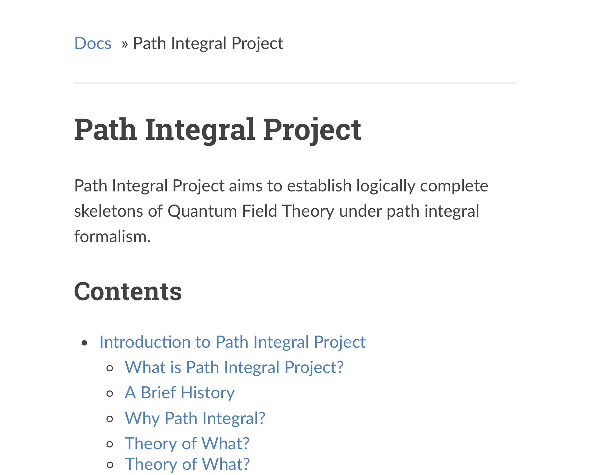

# Exhibition of Works

 This page shows all the works by Zhang Chang-kai, including completed and onging projects and reports. Comments are welcomed.

## Featured Works

  <!-- Gauge Gravity Duality -->
  

  <article class="6u 12u$(xsmall) work-item">
    
  </article>
  <article class="6u 12u$(xsmall) illustration" style="margin: 13px 0">
    
    <a href="Gauge-Gravity-Duality"><h2>Gauge Gravity Duality</h2></a>
    
Brief Review on the Gauge Gravity Duality and its application to holographic entanglement entropy.

    
  </article>
  

  <!-- Constructive Physics -->
  

  <article class="6u 12u$(xsmall) work-item">
    
  </article>
  <article class="6u 12u$(xsmall) illustration" style="margin: 13px 0">
    <a href="Constructive-Physics"><h2>Constructive Physics</h2></a>
    
Constructive Physics Project, an attempt to place theoretical Physics under firm mathematical background.

  </article>
  

  <!-- Structure of Physics -->
  

  <article class="6u 12u$(xsmall) work-item">
    
  </article>
  <article class="6u 12u$(xsmall) illustration" style="margin: 13px 0">
    <a href="Structure-of-Physics"><h2>Structure of Physics</h2></a>
    
This article elaborates the construction of fundamental theory of Physics based solely on requirements on self-consistency.

  </article>
  

## Ongoing Projects

  <!-- Path Integral Project -->
  

  <article class="6u 12u$(xsmall) work-item">
    
  </article>
  <article class="6u 12u$(xsmall) illustration" style="margin: 13px 0">
    
    <a href="Path-Integral-Project"><h2>Path Integral Project</h2></a>
    
This project is a didactic introduction towards rigorous Quantum Field Theory under path integral formalism.

    
  </article>
  

  <!-- Universal Mathematics System -->
  

  <article class="6u 12u$(xsmall) work-item">
    
  </article>
  <article class="6u 12u$(xsmall) illustration" style="margin: 13px 0">
    
    <a href="Universal-Mathematics-System"><h2>Universal Maths System</h2></a>
    
This project is an attempt to formulate and recognize abstract mathemtical theories through computer language.

    
  </article>
  

-----------------------------------

## Regular Works

  <!-- Report on Scientific Haskell -->
  

  <article class="6u 12u$(xsmall) work-item" style="margin: 0 0 0 1.5em; width: 85%">
    
    <a href="https://github.com/Phy-David-Zhang/Scientific-Haskell">
      <h3>Report on Haskell in Scientific Computation</h3></a>
    
This report analyse the possibility of invoking lazy evaluation scheme in Haskell to scientific computation. The efficiency of Schrodinger equation solvers in C, Haskell and Python are investigated and Haskell provides appealing outcomes.

    
  </article>
  

  <!-- Schrodinger Equation Solver -->
  

  <article class="6u 12u$(xsmall) work-item" style="margin: 0 0 0 1.5em; width: 85%">
    
    <a href="https://github.com/Phy-David-Zhang/SchdgerEq">
      <h3>Schrodinger Equation Solver in Haskell</h3></a>
    
This is a Haskell program aimed at solving time-dependent 1D Schrodinger equation using Runge-Kutta method. This program can be at most twice as fast as its Python companion without much loss of readability and extendibility.

    
  </article>
  

  <!-- Report on U(1) Gauge Field Theory -->
  

  <article class="6u 12u$(xsmall) work-item" style="margin: 0 0 0 1.5em; width: 85%">
    
    <a href="https://chx-zh.cc/assets/IntroGauge.pdf">
      <h3>Report on U(1) Gauge Field Theory</h3></a>
    
This is a report given in an Electromagnatism seminar concerning the Electromagnatic interaction described by a U(1) Gauge Field Theory. This report provides a sketch to construct gauge theory from fibre bundle.

    
  </article>
  

